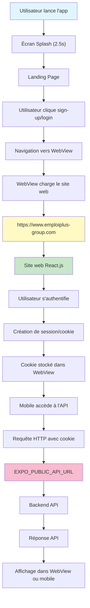

# Architecture de Communication Mobile-Web — Emploiplus App

**Document technique** — Configuration et flux de communication entre l'application mobile React Native et le site web React.js

---

## 1. Architecture Mobile

### Framework & Plateforme

| Élément | Valeur |
|---------|--------|
| **Framework** | React Native avec Expo |
| **Version Expo** | 54.0.0 |
| **React** | 19.1.0 |
| **TypeScript** | 5.9.2 |
| **Système de navigation** | Expo Router (v6.0.24) |
| **Plateforme cible** | Android, iOS, Web |

### Structure du Projet

```
emploiplus-react-native/
├── app/                           # Routes et écrans (Expo Router)
│   ├── _layout.tsx               # Layout root avec gestion du splash
│   ├── index.tsx                 # Écran splash (~2.5s)
│   ├── landing.tsx               # Page d'accueil avec boutons d'authentification
│   └── webview.tsx               # Composant WebView pour pages web intégrées
├── android/                       # Configuration native Android
├── assets/                        # Images et ressources
├── .env                          # Variables d'environnement (dev)
├── .env.production               # Variables d'environnement (prod)
├── app.json                      # Configuration Expo
├── eas.json                      # Profils de build EAS
├── tsconfig.json                 # Configuration TypeScript
└── package.json                  # Dépendances
```

### Flux de Navigation

```
Démarrage
  ↓
app/index.tsx (Splash screen)
  ↓ [2.5s]
app/landing.tsx (Landing page)
  ↓
┌─────────────────────────────────────────────────────┐
│  ┌─────────────────────────────────────────────┐   │
│  │ Bouton "Je m'inscris"  →  app/webview.tsx   │   │
│  │                         (WebView embedded)  │   │
│  │                                             │   │
│  │ Bouton "Se connecter"  →  app/webview.tsx  │   │
│  │                         (WebView embedded)  │   │
│  └─────────────────────────────────────────────┘   │
└─────────────────────────────────────────────────────┘
```

---

## 2. Communication avec le Web

### Canaux de Communication Identifiés

| Fonction | Fichier Source | Technologie | Destination | Protocole |
|----------|---|---|---|---|
| Authentication (Sign-up) | `app/landing.tsx` | WebView | `https://www.emploiplus-group.com/candidate/signup` | HTTPS |
| Authentication (Login) | `app/landing.tsx` | WebView | `https://www.emploiplus-group.com/candidate/login` | HTTPS |
| API générale | `.env` / `.env.production` | HTTP/REST | `EXPO_PUBLIC_API_URL` | HTTPS |
| Navigation Web intégrée | `app/webview.tsx` | WebView (react-native-webview) | URLs paramétrées | HTTPS |

### WebView - Détails d'Intégration

**Fichier:** [app/webview.tsx](app/webview.tsx)

**Caractéristiques:**
- Composant `<WebView>` de la bibliothèque `react-native-webview` (v13.15.0)
- Navigation paramétrée via Expo Router (route `/webview?url={url}&title={title}`)
- **Custom User-Agent identifiant l'app:**
  ```
  EmploiPlusApp/1.0.0 (android|ios; Mobile)
  ```
- **Headers personnalisés:** `X-Requested-With: EmploiPlusApp`
- **Partage de cookies:** `sharedCookiesEnabled={true}` — les cookies du WebView sont partagés avec les requêtes HTTP du système

**Fonctionnalités de navigation:**
- Gestion du bouton "Retour" (back button)
- Affichage d'un spinner de chargement pendant le chargement des pages
- Support de la navigation au sein du WebView
- Retour automatique à la landing page si on clique back sur la page initiale

**Props principales du WebView:**
```tsx
<WebView
  ref={webviewRef}
  source={{ uri: url, headers: { 'X-Requested-With': 'EmploiPlusApp' } }}
  userAgent={USER_AGENT}
  sharedCookiesEnabled={true}
  javaScriptEnabled={true}
  domStorageEnabled={true}
  startInLoadingState={true}
  onLoadStart={() => setLoading(true)}
  onLoadEnd={() => setLoading(false)}
  onNavigationStateChange={(navState) => setCanGoBack(navState.canGoBack)}
/>
```

### API URL

**Variables d'environnement exposées:**

```
EXPO_PUBLIC_API_URL
  ├── Dev:  http://192.168.1.100:3000       (fichier .env)
  └── Prod: https://api.example.com         (fichier .env.production & eas.json)
```

**Note:** La variable doit être préfixée `EXPO_PUBLIC_` pour être exposée au code client React Native.

---

## 3. Authentification

### Flux d'Authentification Actuel

```
Landing Page
  ↓
Utilisateur clique "Je m'inscris" ou "Se connecter"
  ↓
Navigation vers app/webview.tsx
  ↓
WebView charge la page du site web
  (https://www.emploiplus-group.com/candidate/signup ou login)
  ↓
Utilisateur complète le formulaire d'authentification sur le site web
  ↓
Session créée et stockée dans les cookies
```

### Gestion des Sessions

| Mécanisme | Implémentation | Détails |
|---|---|---|
| **Cookies** | WebView avec `sharedCookiesEnabled={true}` | Les cookies du WebView sont automatiquement partagés avec les requêtes HTTP système |
| **Token** | Géré par le site web | Pas de gestion de token côté mobile apparente dans le code actuel |
| **AsyncStorage** | ✗ Non utilisé | Le mobile n'effectue pas de stockage persistant dans le code scanné |
| **SecureStore** | ✗ Non utilisé | Pas de stockage sécurisé des credentials |
| **Supabase Auth** | ✗ Non utilisé | Authentification déléguée au site web |

### Authentification avec le Web

- **Approche:** Authentification 100% déléguée au site web
- **Le site web est responsable de:**
  - Vérification des credentials
  - Création et gestion de la session
  - Émission du cookie de session
- **Le mobile reçoit:**
  - Le cookie de session (automatiquement géré par le WebView)
  - Les données de l'utilisateur (via le contenu de la page web)

---

## 4. WebView

### Pages Web Affichées dans l'Application

| Page | URL | Paramètre | Origine |
|---|---|---|---|
| Inscription | `https://www.emploiplus-group.com/candidate/signup` | `url` + `title` | `app/landing.tsx` |
| Connexion | `https://www.emploiplus-group.com/candidate/login` | `url` + `title` | `app/landing.tsx` |

### Règles de Navigation

**Fichier:** [app/landing.tsx](app/landing.tsx)

```tsx
// Navigation vers le WebView
const openInApp = (url: string, title: string) => {
  const encodedUrl = encodeURIComponent(url);
  const encodedTitle = encodeURIComponent(title);
  router.push(`/webview?url=${encodedUrl}&title=${encodedTitle}`);
};

// Utilisation
openInApp(SIGNUP_URL, 'Inscription');
openInApp(LOGIN_URL, 'Connexion');
```

**Paramètres transmis:**
- `url` : URL encodée de la page à charger
- `title` : Titre de la page (pour affichage)

### Communication JS ↔ WebView

**État actuel:** 
- ✗ Aucune communication bidirectionnelle JS/WebView identifiée dans le code
- Les échanges sont limités à la navigation et au partage de cookies
- Pas d'utilisation de `postMessage()` visible

**Communication disponible mais non utilisée:**
- `webviewRef.current.injectJavaScript()` — Injection de code JS dans le WebView
- `WebView.postMessage()` — Communication depuis le WebView vers React Native
- Event listeners sur `onMessage` — Réception de messages du WebView

### Gestion du Back Button

```tsx
// Fonctionnalité implémentée dans app/webview.tsx
const onBackPress = () => {
  if (canGoBack && webviewRef.current) {
    webviewRef.current.goBack();  // Navigation back dans le WebView
    return true;
  }
  router.replace('/landing');     // Retour à la landing si plus de page back
  return true;
};
```

---

## 5. Configuration

### Variables d'Environnement

**Fichier `.env` (Développement):**
```
EXPO_PUBLIC_API_URL=http://192.168.1.100:3000
```

**Fichier `.env.production` (Production):**
```
EXPO_PUBLIC_API_URL=https://api.example.com
```

**Note:** L'adresse IP `192.168.1.100:3000` doit être adaptée à l'environnement de développement réel.

### Configuration Expo (app.json)

```json
{
  "expo": {
    "name": "Emploiplus-Job",
    "slug": "emploiplus-job",
    "version": "1.0.0",
    "scheme": "emploiplusreactnative",
    "extra": {
      "EXPO_PUBLIC_API_URL": "https://api.example.com"
    },
    "android": {
      "package": "com.anonymous.emploiplusreactnative"
    }
  }
}
```

### Configuration EAS Build (eas.json)

**Profils de build disponibles:**

| Profil | Distribution | Type Build | Variables |
|---|---|---|---|
| `development` | Internal | Development Client | — |
| `preview` | Internal | APK (Android) / Simulator (iOS) | — |
| `production` | — | APK | `EXPO_PUBLIC_API_URL: https://api.example.com` |

**Configuration du profil production:**
```json
{
  "build": {
    "production": {
      "autoIncrement": true,
      "android": {
        "buildType": "apk"
      },
      "env": {
        "EXPO_PUBLIC_API_URL": "https://api.example.com"
      }
    }
  }
}
```

### Dépendances Clés

| Dépendance | Version | Utilisation |
|---|---|---|
| `expo` | ~54.0.0 | Framework mobile |
| `expo-router` | ~6.0.24 | Navigation et routing |
| `react-native-webview` | 13.15.0 | Affichage de pages web intégrées |
| `expo-linking` | ~8.0.12 | Gestion des deep links |
| `expo-constants` | ~18.0.13 | Accès aux constantes Expo |

---

## 6. Données Partagées

### Partage de Données entre Mobile et Web

| Donnée | Source | Accessible Mobile | Accessible Web | Mécanisme |
|---|---|---|---|---|
| **Session utilisateur** | Site web | ✓ Oui | ✓ Oui | Cookies HTTP |
| **Credentials** | Site web | ✗ Non | ✓ Oui | Formulaire HTML |
| **Informations utilisateur** | Site web | ✓ Via contenu HTML | ✓ Oui | Page web |
| **API responses** | API backend | ✓ Oui (futur) | ✓ Oui | EXPO_PUBLIC_API_URL |

### Partage de Cookies

Le WebView est configuré avec `sharedCookiesEnabled={true}`, ce qui signifie:
- Les cookies définis par le site web dans le WebView sont automatiquement envoyés avec les requêtes HTTP du mobile
- Exemple: Un cookie de session créé lors de la connexion sera inclus dans les futures requêtes API

---

## 7. Flux Complet de Communication



### Étapes détaillées:

1. **Démarrage de l'app**
   - Expo Router initialise la route `/`
   - Affichage du splash screen (app/index.tsx)
   - Attente de 2.5 secondes

2. **Landing Page**
   - Affichage de deux boutons: "Je m'inscris" et "Se connecter"
   - Les boutons encodent les URLs de destination

3. **Navigation vers WebView**
   - Clic sur un bouton → appel `openInApp(url, title)`
   - Navigation vers `/webview?url={encodedUrl}&title={encodedTitle}`

4. **Chargement du site web**
   - WebView reçoit l'URL paramétrée
   - Custom User-Agent : `EmploiPlusApp/1.0.0 (android/ios; Mobile)`
   - Header personnalisé: `X-Requested-With: EmploiPlusApp`

5. **Authentification sur le site web**
   - L'utilisateur complète le formulaire d'authentification
   - Le site web crée une session et un cookie
   - Le WebView stocke automatiquement le cookie

6. **Partage de cookies avec l'API**
   - Grâce à `sharedCookiesEnabled={true}`, les cookies sont partagés
   - Les requêtes HTTP vers `EXPO_PUBLIC_API_URL` incluent automatiquement le cookie de session

7. **Accès à l'API**
   - Mobile peut appeler l'API backend avec les credentials stockés dans le cookie
   - Réponses reçues et affichées dans le WebView ou l'application

---

## 8. Fichiers Importants

### Fichiers d'Authentification

| Fichier | Rôle | Type |
|---|---|---|
| [app/landing.tsx](app/landing.tsx) | Page d'accueil avec liens d'authentification | Route Expo Router |
| [app/webview.tsx](app/webview.tsx) | Composant WebView pour le site web | Route Expo Router |

### Fichiers de Configuration

| Fichier | Rôle | Type |
|---|---|---|
| [.env](.env) | Variables d'environnement (dev) | Configuration |
| [.env.production](.env.production) | Variables d'environnement (prod) | Configuration |
| [app.json](app.json) | Configuration Expo (métadonnées, plugins, extra) | Configuration |
| [eas.json](eas.json) | Profils de build EAS (dev, preview, production) | Configuration |

### Fichiers de Navigation & Routing

| Fichier | Rôle | Type |
|---|---|---|
| [app/_layout.tsx](app/_layout.tsx) | Layout root avec gestion du splash screen | Route Expo Router |
| [app/index.tsx](app/index.tsx) | Écran splash initial | Route Expo Router |
| [app/landing.tsx](app/landing.tsx) | Landing page avec boutons de connexion | Route Expo Router |

### Fichiers de WebView

| Fichier | Rôle | Type |
|---|---|---|
| [app/webview.tsx](app/webview.tsx) | Composant WebView pour l'intégration web | Route Expo Router |

### Fichiers de Dépendances

| Fichier | Rôle | Type |
|---|---|---|
| [package.json](package.json) | Dépendances npm et scripts de build | Manifeste |
| [tsconfig.json](tsconfig.json) | Configuration TypeScript | Configuration |

---

## 9. Résumé de l'Architecture

### Approche d'Intégration

L'application mobile utilise une **approche d'intégration WebView** pour communiquer avec le site web:

- **Le site web** gère entièrement l'authentification et les données métier
- **Le mobile** fournit un conteneur natif pour afficher le site web
- **Les cookies** sont partagés automatiquement entre le WebView et les requêtes HTTP

### Flux d'authentification

```
Mobile App (landing)
    ↓
User clique "Connexion"
    ↓
WebView charge signup/login du site
    ↓
Utilisateur s'authentifie sur le site
    ↓
Site web crée un cookie de session
    ↓
Cookie automatiquement partagé (sharedCookiesEnabled)
    ↓
Mobile peut maintenant appeler l'API avec la session valide
```

### Points d'intégration clés

| Point | Description |
|---|---|
| **WebView** | Affichage natif du site web dans l'app |
| **Cookies** | Partage de session entre WebView et API |
| **User-Agent** | Identification du client mobile pour le site web |
| **Headers** | Header `X-Requested-With: EmploiPlusApp` pour identifier l'app |
| **API URL** | Variable d'environnement `EXPO_PUBLIC_API_URL` pour la communication backend |

### Absence de certaines technologies

| Technologie | Utilisée ? | Raison |
|---|---|---|
| **Supabase** | ✗ Non | Authentification déléguée au site web |
| **AsyncStorage** | ✗ Non | Pas de stockage persistant mobile identifié |
| **SecureStore** | ✗ Non | Pas de stockage sécurisé de credentials |
| **Deep linking** | ✗ Non | Pas de schéma d'URI personnalisé exploité (défini mais non utilisé: `emploiplusreactnative://`) |
| **Universal links** | ✗ Non | Pas d'intégration iOS Universal Links |
| **postMessage** | ✗ Non | Pas de communication bidirectionnelle JS/WebView |

---

## 10. Notes Techniques

### Configuration de l'Adresse API

**Important:** Le fichier `.env` contient:
```
EXPO_PUBLIC_API_URL=http://192.168.1.100:3000
```

Cette adresse IP doit être adaptée à votre environnement de développement:
- `192.168.1.100` doit être remplacée par l'IP réelle de la machine de développement
- Accéder à `localhost` ou `127.0.0.1` depuis un appareil mobile réel ne fonctionnera pas

### Identification de l'App

Le site web peut identifier les requêtes mobiles via:
1. **User-Agent:** `EmploiPlusApp/1.0.0 (android|ios; Mobile)`
2. **Header personnalisé:** `X-Requested-With: EmploiPlusApp`

Le site web peut utiliser ces informations pour:
- Adapter l'interface à l'écran mobile
- Activer un "mode natif" ou des fonctionnalités spécifiques
- Logger les accès mobiles vs web

### Sécurité des Cookies

Avec `sharedCookiesEnabled={true}`:
- Les cookies sont automatiquement inclus dans les requêtes HTTP du mobile
- Les cookies HttpOnly définis par le site web ne sont pas accessibles en JavaScript
- Les cookies Secure (HTTPS only) sont respectés

---

## Conclusion

L'application mobile Emploiplus utilise une architecture simple basée sur **WebView pour l'intégration web**. L'authentification est 100% déléguée au site web, avec un partage automatique des cookies pour synchroniser la session. Cette approche permet une maintenance centralisée de la logique métier et de l'authentification sur le site web, tandis que le mobile fournit une expérience native avec l'intégration des pages web.

